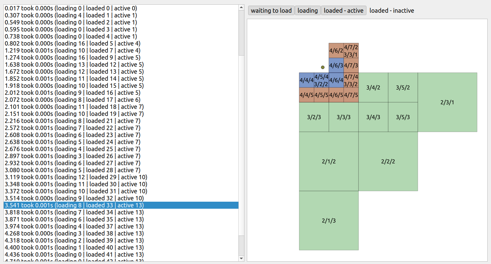

# QGIS 3D Chunked Entity Debug

This tool is to help QGIS 3D developers to better understand what is happening when 3D view is running
and loading/unloading chunks (tiles) as needed. It could be used for debugging issues, profiling or
finding ways how to optimize strategies for loading/unloading data.

The idea is that when a 3D view is running, we record update events and dump all that to a JSON file.
Then there is a simple PyQt GUI for visualization of these logs.

How to use:

1. Compile QGIS with `entity_log.diff` from this repo applied in it (possibly adjust output path for JSON)

2. Run QGIS with 3D view, then close it - JSON file should appear

3. Run `python chunkloader_gui.py <json_log_file>` to visualize recorded data (you may need to adjust path to QGIS in the python script)

